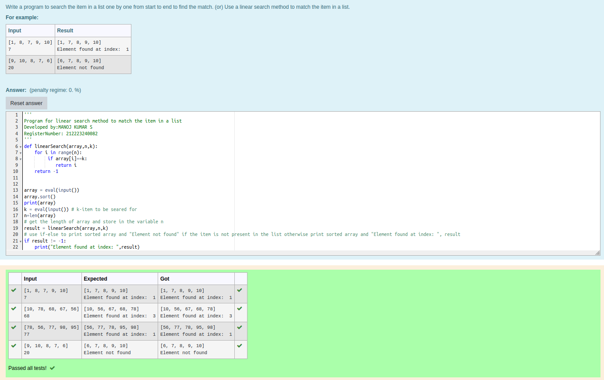
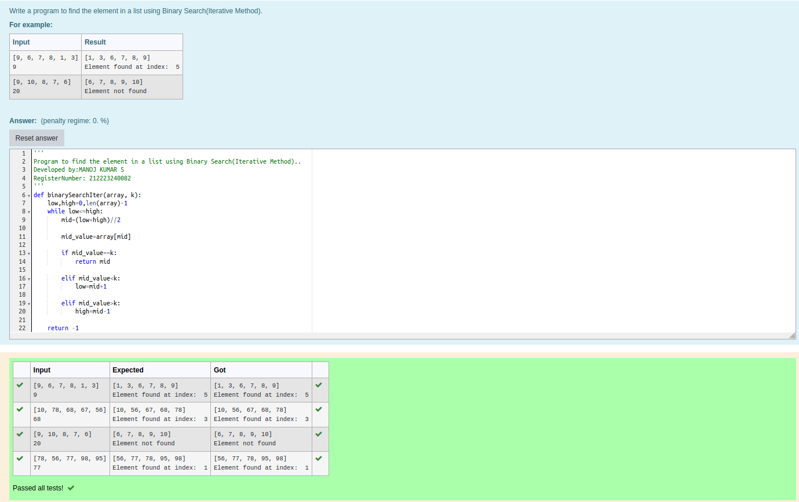
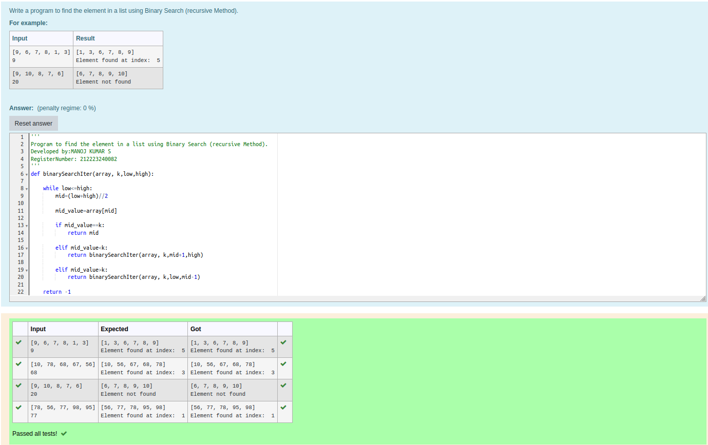

# Linear Search and Binary search
## Aim:
To write a program to perform linear search and binary search using python programming.
## Equipment’s required:
1.	Hardware – PCs
2.	Anaconda – Python 3.7 Installation / Moodle-Code Runner
## Algorithm:
## Linear Search:
1.	Start from the leftmost element of array[] and compare k with each element of array[] one by one.
2.	If k matches with an element in array[] , return the index.
3.	If k doesn’t match with any of elements in array[], return -1 or element not found.
## Binary Search:
1.	Set two pointers low and high at the lowest and the highest positions respectively.
2.	Find the middle element mid of the array ie. arr[(low + high)/2]
3.	If x == mid, then return mid.Else, compare the element to be searched with m.
4.	If x > mid, compare x with the middle element of the elements on the right side of mid. This is done by setting low to low = mid + 1.
5.	Else, compare x with the middle element of the elements on the left side of mid. This is done by setting high to high = mid - 1.
6.	Repeat steps 2 to 5 until low meets high
## Program:
i)	#Use a linear search method to match the item in a list.
```
''' 
Program for linear search method to match the item in a list
Developed by:MANOJ KUMAR S
RegisterNumber: 212223240082
'''
def linearSearch(array,n,k):
    for i in range(n):
         if array[i]==k:
            return i
    return -1

    
array = eval(input())
array.sort()
print(array)
k = eval(input()) # k-item to be seared for
n=len(array)
# get the length of array and store in the variable n
result = linearSearch(array,n,k)
# use if-else to print sorted array and "Element not found" if the item is not present in the list otherwise print sorted array and "Element found at index: ", result
if result != -1:
    print("Element found at index: ",result)
    
else:
    print("Element not found")


```
ii)	# Find the element in a list using Binary Search(Iterative Method).
```
''' 
Program to find the element in a list using Binary Search(Iterative Method)..
Developed by:MANOJ KUMAR S
RegisterNumber: 212223240082
'''
def binarySearchIter(array, k):
    low,high=0,len(array)-1
    while low<=high:
        mid=(low+high)//2
        
        mid_value=array[mid]
    
        if mid_value==k:
            return mid
    
        elif mid_value<k:
            low=mid+1
        
        elif mid_value>k:
            high=mid-1
    
    return -1
    
    
array = eval(input())
array.sort()
print(array)

k = eval(input()) 
result=binarySearchIter(array, k)

if result != -1:
    print("Element found at index: ",result)
    
else:
    print("Element not found")


```
iii)	# Find the element in a list using Binary Search (recursive Method).
```
''' 
Program to find the element in a list using Binary Search (recursive Method).
Developed by:MANOJ KUMAR S
RegisterNumber: 212223240082
'''
def binarySearchIter(array, k,low,high):
    
    while low<=high:
        mid=(low+high)//2
        
        mid_value=array[mid]
    
        if mid_value==k:
            return mid
    
        elif mid_value<k:
            return binarySearchIter(array, k,mid+1,high)
        
        elif mid_value>k:
            return binarySearchIter(array, k,low,mid-1)
    
    return -1
    
    
array = eval(input())
array.sort()
print(array)
low=0
high=len(array)-1
k = eval(input()) 
result=binarySearchIter(array, k,low,high)

if result != -1:
    print("Element found at index: ",result)
    
else:
    print("Element not found")

''' 


```
## Output:
i)

ii)

iii)



## Result
Thus the linear search and binary search algorithm is implemented using python programming.